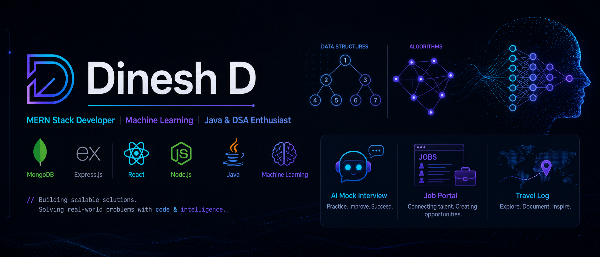

<!-- ===================== BANNER ===================== -->

<div align="center">



</div>

<br/>

<!-- ===================== INTRODUCTION ===================== -->

<h1 align="center">Hi, I'm Dinesh Dharavath 👋</h1>

<h3 align="center">
  Machine Learning Enthusiast | Full Stack Developer | Java & DSA
</h3>

<p align="center">
  Computer Science student passionate about Machine Learning, building real-world applications, 
  and solving challenging problems through code.
</p>

<p align="center">
  <a href="https://github.com/ad-Dinesh">
    
  </a>
  
</p>

---

## 💡 About Me

- 🎓 Pursuing **B.Tech in Computer Science and Engineering** at **Indian Institute of Information Technology, Design and Manufacturing (IIITDM), Jabalpur**

- 🤖 Currently focusing on **Machine Learning**, **Data Analysis**, and building practical ML projects

- 🧠 Strengthening my **Data Structures & Algorithms** and problem-solving skills using **Java**

- 💻 Experienced in building full-stack web applications using the **MERN Stack**

- 🚀 Exploring the integration of **Artificial Intelligence and Machine Learning with real-world applications**

- 🌱 Currently learning **Machine Learning, Python for Data Science, NumPy, Pandas, Scikit-learn, and ML Algorithms**

- 💬 Ask me about **Python, Machine Learning, Java, DSA, React, Next.js, Node.js, Express.js, and MongoDB**

- ⚡ I enjoy learning new technologies by building projects and solving real-world problems

---

## 🎯 Currently Focusing On

```text
🤖 Machine Learning        ████████████████████
🐍 Python & Data Analysis  ███████████████████░
🧠 DSA & Problem Solving   ██████████████████░░
💻 Full Stack Development  █████████████████░░░
